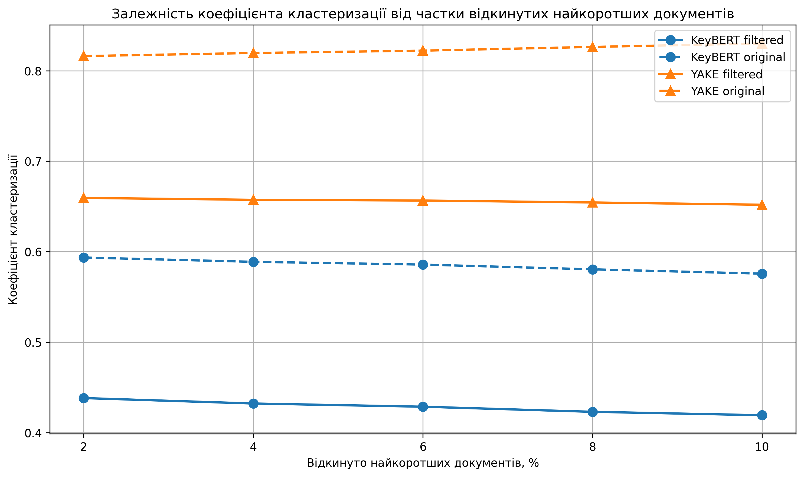
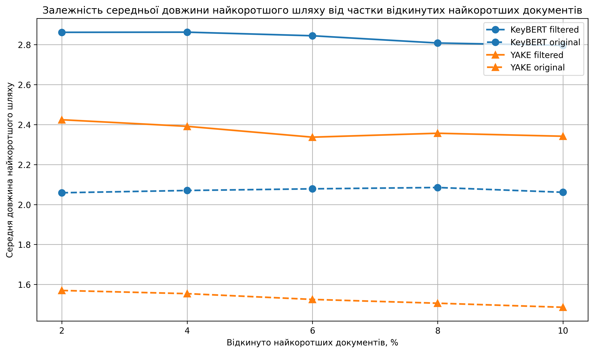
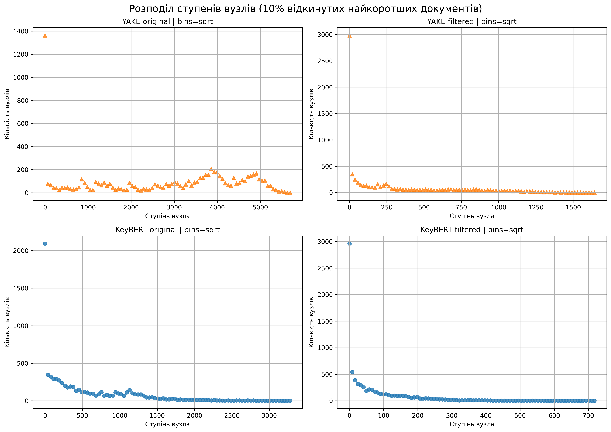
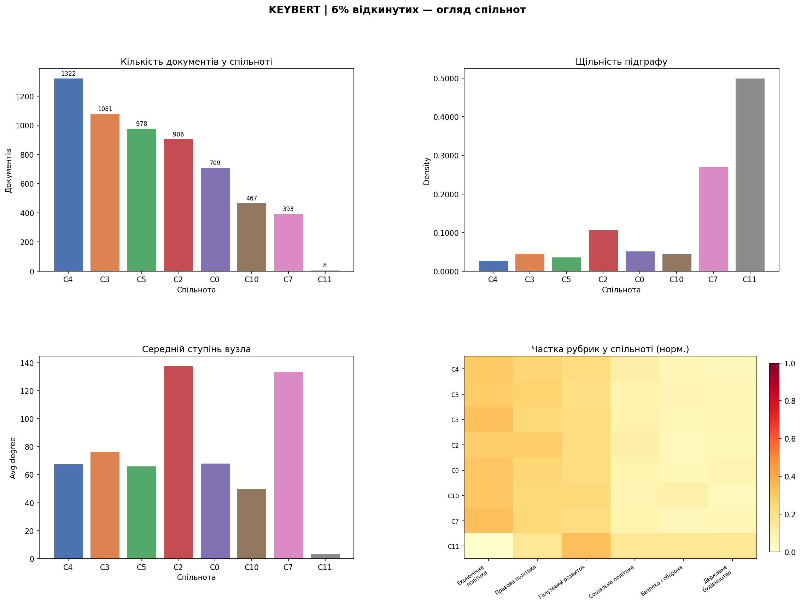
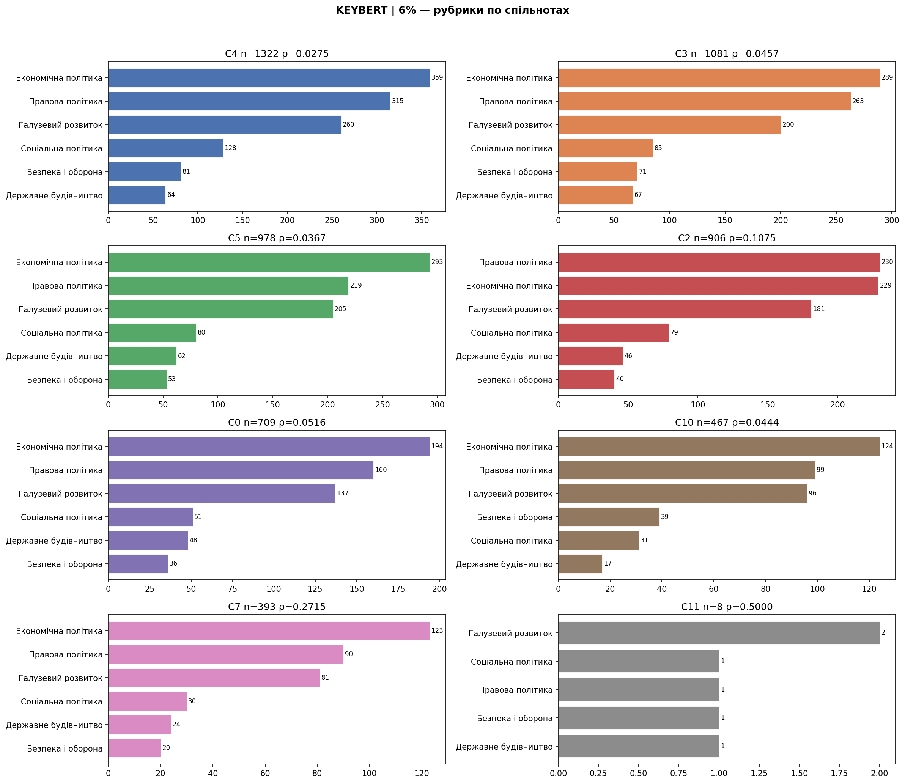
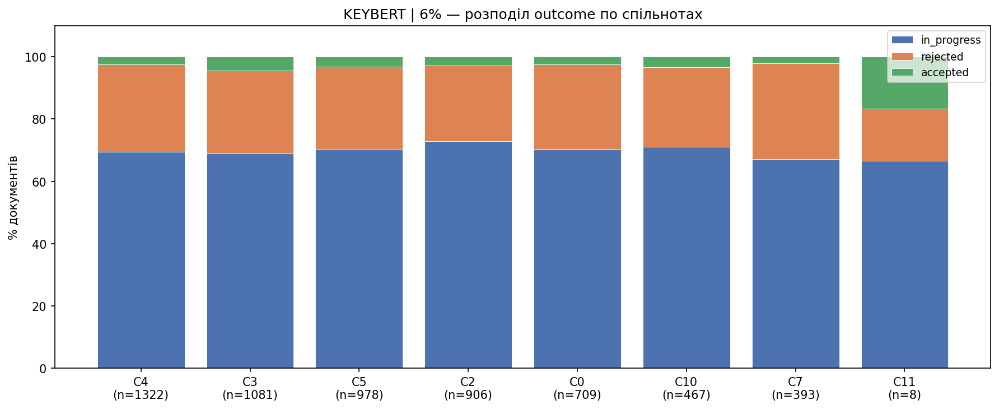
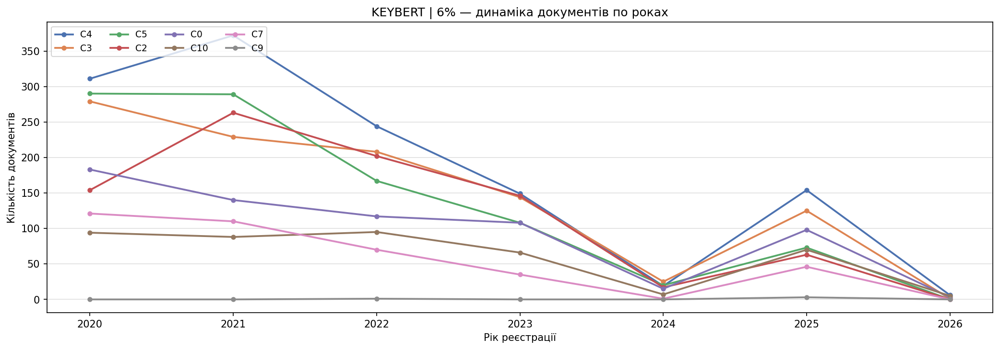
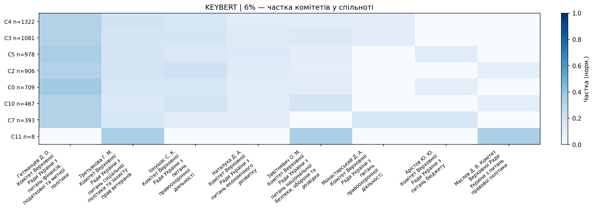
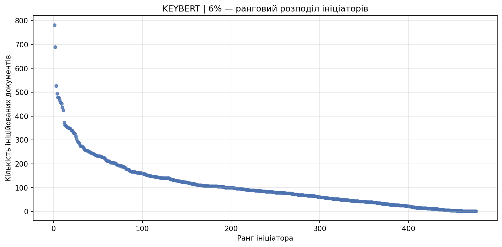
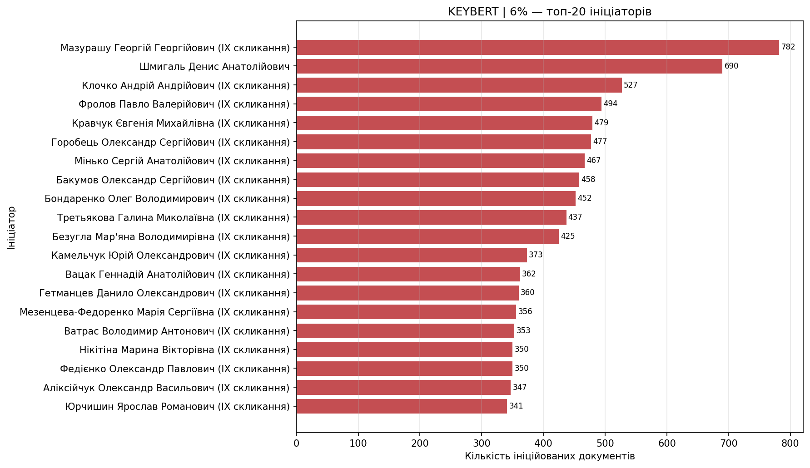

# Збір даних про законопроєкти та їхній статистичний аналіз

Програмний комплекс для автоматизованого збору, обробки та аналізу порівняльних таблиць законопроєктів Верховної Ради України за період 2020–2026 рр.

Розроблено в рамках дипломної роботи.

## Мета

Побудова та аналіз мережі законодавчих документів на основі спільних ключових слів із застосуванням методів мережевого аналізу та обробки природної мови.

## Функціональність

- Автоматизований збір порівняльних таблиць з офіційного сайту Верховної Ради ([itd.rada.gov.ua](https://itd.rada.gov.ua))
- Конвертація документів із формату DOCX у PDF
- Паралельне витягування тексту з PDF-файлів
- Збагачення документів метаданими (рубрика, ініціатор, комітет, статус проходження)
- Витягування ключових слів (YAKE, KeyBERT) з фіксацією часу виконання
- Побудова та аналіз мережі документів (асортативність, кластеризація, спільноти)
- Лінгвістична статистика текстів

## Структура проєкту

```text
PdfParserVRU/
│
├── main.py
├── requirements.txt
├── README.md
│
├── analysis/
│   ├── extract_keywords_yake.py
│   ├── extract_keywords_keybert.py
│   ├── build_network_yake.py
│   ├── build_network_keyBERT.py
│   └── community_analysis_keybert.py
│
├── parsers/
│   ├── parse_pdfs.py
│   └── unite_parsed.py
│
├── notebooks/
│   ├── keywords_analysis.ipynb
│   ├── keywords_yake.ipynb
│   ├── keywords_keybert.ipynb
│   └── network_metrics_summary.ipynb
│
├── dataset_comparative_2020_2026/
│   ├── bills.csv
│   ├── comparative_tables.csv
│   ├── passage.csv
│   │
│   └── comparative_files/
│       ├── keyBert/
│       ├── keyBert_metrics/
│       ├── keyBert_Filtred_metrics/
│       ├── keywords_keybert_filtered/
│       │   
│       ├── parsed_pdfs.parquet
│       ├── parsed_pdfs_meta.csv
│       ├── enriched_docs.parquet
│       ├── enriched_docs_meta.csv
│       │
│       ├── keywords_yake.parquet
│       ├── keywords_keybert.parquet
│       ├── yake_timing.json
│       ├── keybert_timing.json
│       │
│       ├── yake/
│       ├── yake_metrics/
│       ├── yake_Filtred_metrics/
│       ├── keywords_yake_filtred/
│       │
│       └── network_figures/
│
└── community_analysis/
    └── results/
        └── keybert_6pct/
```

## Залежності

```bash
pip install -r requirements.txt
```
> `pywin32` — лише для Windows (конвертація DOCX → PDF через Microsoft Word)  
> `rustworkx` встановлюється окремо: `pip install rustworkx`

## Запуск

### Крок 1 — Збір даних з сайту Ради
```bash
python main.py
```

### Крок 2 — Парсинг PDF
```bash
python parsers/parse_pdfs.py
```
Результат:
- `comparative_files/parsed_pdfs.parquet` — повний текст документів
- `comparative_files/parsed_pdfs_meta.csv` — метадані без тексту

### Крок 3 — Збагачення метаданими
```bash
python parsers/unite_parsed.py
```
З'єднує документи з `bills.csv`, `comparative_tables.csv`, `passage.csv`.
Результат: `comparative_files/enriched_docs.parquet`

### Крок 4 — Витягування ключових слів
```bash
python analysis/extract_keywords_yake.py
python analysis/extract_keywords_keybert.py
```
Результат:
- `comparative_files/keywords_yake.parquet`
- `comparative_files/keywords_keybert.parquet`
- `comparative_files/yake_timing.json`
- `comparative_files/keybert_timing.json`

### Крок 5 — Аналіз і фільтрація ключових слів у notebooks

Фільтрація та попередній аналіз ключових слів виконуються у Jupyter Notebook:

```text
notebooks/keywords_yake.ipynb
notebooks/keywords_keybert.ipynb
notebooks/keywords_analysis.ipynb
```

На цьому етапі:

- аналізуються найчастіші ключові слова;
- обчислюється document frequency;
- вилучаються ключові слова, які зустрічаються більш ніж у 9% документів;
- формуються версії датасету з відкиданням 2%, 4%, 6%, 8% і 10% найкоротших документів.

Результат для YAKE:
- `comparative_files/keywords_yake_filtred/keywords_yake_filtred_2pct.parquet`;
- `comparative_files/keywords_yake_filtred/keywords_yake_filtred_4pct.parquet`;
- `comparative_files/keywords_yake_filtred/keywords_yake_filtred_6pct.parquet`;
- `comparative_files/keywords_yake_filtred/keywords_yake_filtred_8pct.parquet`;
- `comparative_files/keywords_yake_filtred/keywords_yake_filtred_10pct.parquet`.

Результат для KeyBERT:
- `comparative_files/keywords_keybert_filtered/keywords_keybert_filtered_2pct.parquet`;
- `comparative_files/keywords_keybert_filtered/keywords_keybert_filtered_4pct.parquet`;
- `comparative_files/keywords_keybert_filtered/keywords_keybert_filtered_6pct.parquet`;
- `comparative_files/keywords_keybert_filtered/keywords_keybert_filtered_8pct.parquet`;
- `comparative_files/keywords_keybert_filtered/keywords_keybert_filtered_10pct.parquet`.

### Крок 6 — Побудова мереж документів

```bash
python analysis/build_network_yake.py
python analysis/build_network_keyBERT.py
```

На цьому етапі будуються графи документів. Вузол графа відповідає окремому документу, а ребро створюється тоді, коли два документи мають щонайменше два спільні ключові слова:

```python
MIN_SHARED = 2
```

Графи будуються для всіх варіантів відкидання найкоротших документів: 2%, 4%, 6%, 8% і 10%.

Результат:
- `.pkl` файли графів;
- `.json` файли з метриками;
- файли розподілу ступенів вузлів;
- CSV/JSON з додатковими характеристиками мереж.


### Крок 7 — Порівняння мережевих метрик

Порівняння результатів YAKE та KeyBERT виконується у notebook:

```text
notebooks/network_metrics_summary.ipynb
```

У ньому аналізуються:

- кількість вузлів і ребер;
- густина графа;
- кількість компонент зв’язності;
- розмір найбільшої компоненти;
- кількість ізольованих вузлів;
- середній і максимальний ступінь;
- коефіцієнт кластеризації;
- середня довжина найкоротшого шляху;
- modularity;
- Louvain-спільноти;
- small-world властивість;
- degree distribution;
- degree-rank distribution;
- PDF розподілу ступенів.

Результати зберігаються у:

```text
comparative_files/network_figures/
```

---

### Крок 8 — Аналіз Louvain-спільнот

```bash
python analysis/community_analysis_keybert.py
```

На цьому етапі окремо аналізуються Louvain-спільноти для графа **KeyBERT filtered 6%**. Для інтерпретації спільнот використовуються метадані з `enriched_docs.parquet`.

Будуються графіки:

- загальний огляд спільнот;
- розподіл рубрик по спільнотах;
- розподіл outcome;
- динаміка документів по роках;
- теплова карта головних комітетів;
- ранговий розподіл ініціаторів;
- топ-20 ініціаторів.

Результат:

```text
community_analysis/results/keybert_6pct/
```

## Датасет

| Параметр | Значення |
|---|---|
| Джерело | itd.rada.gov.ua |
| Період | 2020–2026 |
| Кількість документів | ~7100 |
| Мова | Українська |
| Тип | Порівняльні таблиці законопроєктів |

## Notebooks

### `notebooks/keywords_analysis.ipynb`
Дослідження та порівняння ключових слів витягнутих алгоритмами YAKE та KeyBERT.

**Що робить:**
- Завантажує `keywords_yake_meta.csv` та `keywords_keybert_meta.csv`
- Будує частотний розподіл ключових слів по всьому корпусу для обох методів
- Візуалізує топ-50 найчастіших ключових слів
- Аналізує ключові слова по рубриках законопроєктів
- Підраховує document frequency (DF) — в скількох документах зустрічається кожне KW
- Порівнює топ-20 KW YAKE vs KeyBERT на одному графіку
- Порівнює час виконання обох методів

**Ключові слова (KW)** — це слова або словосполучення, що найкраще описують тематику документа.
Кількість KW для кожного документа залежить від його довжини: від 5 для коротких до 50 для довгих документів.

**YAKE** визначає KW статистично — на основі частоти, позиції у тексті та співвідношення з іншими словами, без використання зовнішнього корпусу текстів.

**KeyBERT** визначає KW семантично — через косинусну подібність між ембедингами тексту і кандидатів на основі моделі `paraphrase-multilingual-MiniLM-L12-v2`.

## Витягування ключових слів

| Параметр | YAKE | KeyBERT |
|---|---|---|
| Тип | Статистичний | Семантичний |
| Модель | Не потрібна | paraphrase-multilingual-MiniLM-L12-v2 |
| Час всього | 9.4 хв | 354.8 хв |
| На документ | 0.075с | 2.823с |
| Середня к-сть KW | 20.9 | 20.9 |

YAKE краще вловлює структурні особливості тексту — витягує специфічні для документа фрази, 
але також захоплює службові артефакти порівняльних таблиць (`порівняльна таблиця`, 
`чинна редакція`, `відомості верховної`).

KeyBERT більш семантично однорідний — тяжіє до загальних юридичних фраз 
(`закону україни`, `кодексу україни`, `депутати україни`) і рідше захоплює 
структурні артефакти, але менш чутливий до тематичних відмінностей між документами.

### Фільтрація ключових слів у notebooks

Після автоматичного витягування ключових слів виконується додаткова обробка у Jupyter Notebook. Для цього використовуються окремі ноутбуки для двох методів:

```text
notebooks/keywords_yake.ipynb
notebooks/keywords_keybert.ipynb
```

У цих ноутбуках проводиться фільтрація ключових слів, отриманих методами **YAKE** та **KeyBERT**. Основна мета цього етапу — прибрати занадто загальні ключові слова, які зустрічаються у великій кількості документів і можуть штучно збільшувати зв’язність майбутнього графа.

Для фільтрації використовується поріг **9%**. Якщо ключове слово зустрічається більш ніж у 9% документів, воно вилучається з набору ключових слів. Такі слова вважаються надто загальними, оскільки вони не допомагають якісно розрізняти документи за змістом.

Після очищення ключових слів також формуються додаткові версії датасету з відкиданням найкоротших документів:

- 2%;
- 4%;
- 6%;
- 8%;
- 10%.

Це потрібно для перевірки того, як короткі документи впливають на структуру мережі. Короткі документи зазвичай мають менше ключових слів, слабше з’єднуються з іншими документами або утворюють ізольовані вузли.

Результатом цього етапу є очищені набори даних для подальшої побудови графів.

Для YAKE:

```text
comparative_files/keywords_yake_filtred/
```

Приклади файлів:

```text
keywords_yake_filtred_2pct.parquet
keywords_yake_filtred_4pct.parquet
keywords_yake_filtred_6pct.parquet
keywords_yake_filtred_8pct.parquet
keywords_yake_filtred_10pct.parquet
```

Для KeyBERT:

```text
comparative_files/keywords_keybert_filtered/
```

Приклади файлів:

```text
keywords_keybert_filtered_2pct.parquet
keywords_keybert_filtered_4pct.parquet
keywords_keybert_filtered_6pct.parquet
keywords_keybert_filtered_8pct.parquet
keywords_keybert_filtered_10pct.parquet
```

---

### Побудова мереж документів
Після фільтрації ключових слів будуються мережі документів окремо для **YAKE** та **KeyBERT**.

Для цього використовуються скрипти:

```bash
python analysis/build_network_yake.py
python analysis/build_network_keyBERT.py
```

У побудованій мережі:

- **вузол** — це окремий документ;
- **ребро** — зв’язок між двома документами;
- **вага ребра** — кількість спільних ключових слів між двома документами.

Для створення ребра використовується параметр:

```python
MIN_SHARED = 2
```

Це означає, що два документи з’єднуються ребром лише тоді, коли вони мають щонайменше **2 спільні ключові слова**.

Побудова мереж виконується для кількох версій датасету:

- без 2% найкоротших документів;
- без 4% найкоротших документів;
- без 6% найкоротших документів;
- без 8% найкоротших документів;
- без 10% найкоротших документів.

Такий підхід дозволяє порівняти, як поступове вилучення коротких документів впливає на структуру графа.

---

### Розрахунок метрик мережі

Після побудови графів для кожної версії датасету розраховуються основні мережеві метрики:

- кількість вузлів;
- кількість ребер;
- густина графа;
- кількість компонент зв’язності;
- розмір найбільшої компоненти;
- частка найбільшої компоненти;
- кількість ізольованих вузлів;
- середній ступінь вузла;
- максимальний ступінь вузла;
- коефіцієнт кластеризації;
- транзитивність;
- середня довжина найкоротшого шляху;
- асортативність;
- кількість спільнот Louvain;
- modularity;
- перевірка small-world властивості.

Результати зберігаються у форматах `.json`, `.csv` та `.pkl`.

Для YAKE результати зберігаються у папку:

```text
comparative_files/yake_Filtred_metrics/
```

Для KeyBERT результати зберігаються у папку:

```text
comparative_files/keyBert_Filtred_metrics/
```

## Результати мережевого аналізу

Для побудови мереж документів було використано два методи виділення ключових слів: **YAKE** та **KeyBERT**. Для обох підходів графи будувалися за однаковим принципом: два документи з’єднувалися ребром, якщо мали щонайменше `MIN_SHARED = 2` спільні ключові слова.

Перед побудовою графів було виконано попередню фільтрацію ключових слів та сформовано кілька версій датасету з відкиданням найкоротших документів: **2%**, **4%**, **6%**, **8%** та **10%**. Це дозволило перевірити, як короткі документи впливають на структуру мережі.

### YAKE vs KeyBERT Metrics

## Порівняльна таблиця мереж YAKE та KeyBERT після фільтрації коротких документів

| Removed shortest docs | Method           | Documents | Unique keywords | Edges      | Largest component | Isolated nodes | Clustering | Transitivity | Avg path | Avg degree | Max degree | Communities | Modularity | Small-world |
| --------------------: | ---------------- | --------: | --------------: | ---------: | ----------------: | -------------: | ---------: | -----------: | -------: | ---------: | ---------: | ----------: | ---------: | ----------- |
| 2%  | YAKE filtered    | 8,257 | 17,960 | 1,043,154  | 5,957 (72.14%) | 2,160 | 0.659367 | 0.471437 | 2.4241 | 252.6714  | 1667 | 19 | 0.343581 | False |
| 2%  | KeyBERT filtered | 8,257 | 66,462 | 250,904    | 6,098 (73.85%) | 1,994 | 0.438143 | 0.302011 | 2.8858 | 60.7736   | 778  | 22 | 0.457648 | True  |
| 2%  | YAKE          | 8,257 | 133,857     | 11,125,382 | 6,940 (84.05%) | 1,315 | 0.816154 | 0.766490 | 1.5699 | 2694.7758 | 6252 | 5  | 0.140378 | False |
| 2%  | KeyBERT      | 8,257 | 163,105      | 2,263,367  | 6,765 (81.93%) | 1,444 | 0.593491 | 0.588345 | 2.0588 | 548.2299  | 3726 | 12 | 0.360567 | False |
| 4%  | YAKE filtered    | 8,082 | 17,926 | 1,040,507  | 5,868 (72.61%) | 2,085 | 0.657287 | 0.471384 | 2.3912 | 257.4875  | 1665 | 16 | 0.338253 | False |
| 4%  | KeyBERT filtered | 8,082 | 66,373 | 246,372    | 5,984 (74.04%) | 1,943 | 0.432142 | 0.298948 | 2.8849 | 60.9681   | 764  | 18 | 0.448301 | True  |
| 4%  | YAKE        | 8,082 | 133,445      | 10,853,315 | 6,790 (84.01%) | 1,292 | 0.819567 | 0.772108 | 1.5540 | 2685.7993 | 6125 | 5  | 0.136878 | False |
| 4%  | KeyBERT     | 8,082 | 162,5509     | 2,134,679  | 6,621 (81.92%) | 1,416 | 0.588746 | 0.578951 | 2.0702 | 528.2551  | 3618 | 13 | 0.359951 | False |
| 6%  | YAKE filtered    | 7,918 | 17,898 | 1,037,943  | 5,801 (73.26%) | 2,008 | 0.656486 | 0.471342 | 2.3370 | 262.1730  | 1664 | 15 | 0.339685 | False |
| 6%  | KeyBERT filtered | 7,918 | 66,287 | 243,260    | 5,896 (74.46%) | 1,870 | 0.428593 | 0.297500 | 2.8615 | 61.4448   | 754  | 16 | 0.447947 | True  |
| 6%  | YAKE         | 7,918 |  133,091     | 10,605,648 | 6,662 (84.14%) | 1,256 | 0.822155 | 0.777027 | 1.5251 | 2678.8704 | 6016 | 4  | 0.132247 | False |
| 6%  | KeyBERT     | 7,918 | 161,948      | 2,031,700  | 6,503 (82.13%) | 1,375 | 0.585692 | 0.571706 | 2.0785 | 513.1851  | 3525 | 12 | 0.360253 | False |
| 8%  | YAKE filtered    | 7,748 | 17,872 | 1,033,142  | 5,711 (73.71%) | 1,943 | 0.654350 | 0.471074 | 2.3566 | 266.6861  | 1664 | 21 | 0.337243 | False |
| 8%  | KeyBERT filtered | 7,748 | 66,202 | 239,449    | 5,769 (74.46%) | 1,834 | 0.422959 | 0.296251 | 2.8028 | 61.8092   | 737  | 19 | 0.438638 | True  |
| 8%  | YAKE        | 7,748 | 132,695      | 10,336,358 | 6,507 (83.98%) | 1,241 | 0.826266 | 0.783069 | 1.5061 | 2668.1358 | 5885 | 4  | 0.125565 | False |
| 8%  | KeyBERT      | 7,748 | 161,392      | 1,906,254  | 6,356 (82.03%) | 1,357 | 0.580442 | 0.561654 | 2.0851 | 492.0635  | 3416 | 14 | 0.357171 | False |
| 10% | YAKE filtered    | 7,582 | 17,840 | 1,028,324  | 5,631 (74.27%) | 1,870 | 0.651838 | 0.470952 | 2.3416 | 271.2540  | 1661 | 15 | 0.329581 | False |
| 10% | KeyBERT filtered | 7,582 | 66,094 | 236,663    | 5,660 (74.65%) | 1,790 | 0.419197 | 0.294884 | 2.8056 | 62.4276   | 726  | 23 | 0.443667 | True  |
| 10% | YAKE        | 7,582 | 132,319     | 10,063,032 | 6,357 (83.84%) | 1,225 | 0.830108 | 0.789212 | 1.4858 | 2654.4532 | 5756 | 5  | 0.117291 | False |
| 10% | KeyBERT      | 7,582 | 160,820      | 1,800,312  | 6,214 (81.96%) | 1,334 | 0.575664 | 0.551610 | 2.0612 | 474.8911  | 3315 | 11 | 0.357018 | False |

Порівняння показує, що **YAKE формує значно щільніший граф**, ніж KeyBERT. Наприклад, при відкиданні 2% найкоротших документів YAKE створює **1,043,154 ребра**, тоді як KeyBERT — лише **250,904 ребра**. Тобто YAKE формує приблизно у чотири рази більше зв’язків між документами.

Це також підтверджується середнім ступенем вузла. У YAKE середній ступінь зростає від **252.67** до **271.25**, тоді як у KeyBERT він залишається в межах **60.77–62.43**. Отже, YAKE створює дуже насичену мережу, де один документ у середньому пов’язаний із великою кількістю інших документів.

Водночас KeyBERT має значно більшу кількість унікальних ключових слів — приблизно **66 тис.**, тоді як YAKE — близько **18 тис.**. Попри це, KeyBERT створює менше ребер, що свідчить про вищу специфічність ключових слів. Іншими словами, KeyBERT краще розділяє документи за змістом і не формує надмірної кількості зв’язків.

YAKE має вищий коефіцієнт кластеризації — приблизно **0.65**, тоді як у KeyBERT цей показник становить близько **0.42–0.44**. Також YAKE демонструє коротший середній шлях між вузлами. Однак ці характеристики частково пояснюються надмірною щільністю графа: коли кількість ребер дуже велика, документи автоматично стають ближчими один до одного.

Важливою перевагою KeyBERT є вища **modularity**. Для KeyBERT вона перебуває в межах **0.44–0.46**, тоді як для YAKE — приблизно **0.33–0.34**. Це означає, що у графі, побудованому на основі KeyBERT, тематичні спільноти виражені чіткіше.

Ще одна важлива відмінність полягає у властивості **small-world network**. У всіх протестованих варіантах графи KeyBERT класифікуються як small-world, тоді як графи YAKE — ні. Це свідчить про те, що KeyBERT краще зберігає баланс між локальною зв’язністю, короткими шляхами та структурною роздільністю мережі.

### Висновок мережевого аналізу

За результатами порівняння можна зробити висновок, що **YAKE краще підходить для побудови дуже щільної мережі з великою кількістю зв’язків**, однак така мережа може бути перенасиченою і менш зручною для тематичного аналізу.
**KeyBERT формує більш збалансовану та структуровану мережу**. Він створює менше ребер, має вищу modularity, менше ізольованих вузлів і стабільно зберігає small-world властивість. Тому для подальшого аналізу тематичних спільнот і структури документів KeyBERT виглядає більш придатним методом.
### Аналіз впливу відкидання найкоротших документів

Для оцінки стабільності побудованих мереж було перевірено, як змінюються основні графові метрики при поступовому відкиданні найкоротших документів. Було сформовано п’ять варіантів датасету: з відкиданням **2%**, **4%**, **6%**, **8%** та **10%** найкоротших текстів.

Аналіз проводився для чотирьох варіантів графів:

- **YAKE original** — граф, побудований на початкових ключових словах YAKE;
- **YAKE filtered** — граф, побудований після фільтрації надто частих ключових слів YAKE;
- **KeyBERT original** — граф, побудований на початкових ключових словах KeyBERT;
- **KeyBERT filtered** — граф, побудований після фільтрації надто частих ключових слів KeyBERT.

У кожному випадку ребро між двома документами створювалося тоді, коли вони мали щонайменше `MIN_SHARED = 2` спільні ключові слова.


#### Залежність коефіцієнта кластеризації

Коефіцієнт кластеризації показує, наскільки сильно вузли графа утворюють локальні групи. У межах цієї роботи вузол відповідає документу, а ребро означає наявність спільних ключових слів між двома документами. Тому ця метрика показує, наскільки часто документи, пов’язані з одним і тим самим документом, також пов’язані між собою.



З рисунка видно, що при відкиданні від **2%** до **10%** найкоротших документів коефіцієнт кластеризації змінюється незначно. Це означає, що вилучення коротких текстів не має суттєвого впливу на локальну структуру мережі.

Найвищі значення коефіцієнта кластеризації спостерігаються для **YAKE original**. Це пояснюється тим, що без додаткової фільтрації YAKE створює дуже щільний граф із великою кількістю ребер. Водночас надто високий clustering не завжди означає кращу якість графа, оскільки він може бути наслідком перенасичення мережі загальними ключовими словами.

Після фільтрації частих ключових слів значення коефіцієнта кластеризації зменшується. Найнижчі значення має **KeyBERT filtered**, однак це можна вважати позитивним результатом, оскільки такий граф є менш перенасиченим і більш вибірковим.


#### Залежність середньої довжини найкоротшого шляху

Середня довжина найкоротшого шляху показує, скільки кроків у середньому потрібно, щоб перейти від одного документа до іншого в межах найбільшої з’єднаної компоненти графа.



З рисунка видно, що середня довжина найкоротшого шляху також змінюється плавно й без різких коливань. Це означає, що вилучення найкоротших документів у межах від **2%** до **10%** не змінює суттєво глобальну зв’язність мережі.

Найменші значення цієї метрики має **YAKE original**, оскільки цей граф є найбільш щільним: через велику кількість ребер документи розташовані дуже близько один до одного. Найбільші значення має **KeyBERT filtered**, оскільки після фільтрації граф стає менш щільним і більш структурованим.

Загалом обидва рисунки показують, що вплив відкидання найкоротших документів є відносно слабким. Значно більший вплив на структуру графа має метод виділення ключових слів (**YAKE** або **KeyBERT**) та фільтрація надто частих ключових слів.


#### Порівняння змін між 2% і 10%

| Метод | Режим | Clustering 2% | Clustering 10% | Зміна clustering | Зміна clustering, % | Avg path 2% | Avg path 10% | Зміна avg path | Зміна avg path, % |
|---|---|---:|---:|---:|---:|---:|---:|---:|---:|
| KeyBERT | filtered | 0.438143 | 0.419197 | -0.018946 | -4.32% | 2.8616 | 2.7964 | -0.0652 | -2.28% |
| KeyBERT | original | 0.593491 | 0.575664 | -0.017827 | -3.00% | 2.0588 | 2.0612 | 0.0024 | 0.12% |
| YAKE | filtered | 0.659367 | 0.651838 | -0.007529 | -1.14% | 2.4241 | 2.3416 | -0.0825 | -3.40% |
| YAKE | original | 0.816154 | 0.830108 | 0.013954 | 1.71% | 1.5699 | 1.4858 | -0.0841 | -5.36% |

Результати показують, що структура графів є достатньо стабільною до вилучення коротких документів. Коефіцієнт кластеризації змінюється в межах від **-4.32%** до **+1.71%**, а середня довжина найкоротшого шляху — в межах від **-5.36%** до **+0.12%**.

Отже, відкидання найкоротших документів має обмежений вплив на основні структурні характеристики мережі. Водночас різниця між методами YAKE і KeyBERT, а також між початковими та фільтрованими ключовими словами, є значно суттєвішою.

### Розподіл ступенів вузлів

Для додаткового аналізу структури побудованих мереж було розглянуто розподіл ступенів вузлів. Ступінь вузла показує, з якою кількістю інших документів пов’язаний конкретний документ. У цій роботі високий ступінь означає, що документ має багато зв’язків з іншими документами через спільні ключові слова.

Було побудовано розподіли ступенів для чотирьох варіантів графів:

- **YAKE original**;
- **YAKE filtered**;
- **KeyBERT original**;
- **KeyBERT filtered**.



Найбільш нерівномірний розподіл спостерігається для **YAKE original**. У цьому варіанті багато вузлів мають високі значення ступеня, що свідчить про перенасичення графа зв’язками. Це пояснюється тим, що без фільтрації YAKE залишає багато загальних ключових слів, які масово з’єднують документи між собою.

Після фільтрації частих ключових слів граф **YAKE filtered** стає більш збалансованим: кількість надмірно зв’язаних вузлів зменшується, а структура стає зрозумілішою для подальшого аналізу.

**KeyBERT original** також формує досить зв’язаний граф, однак він менш перенасичений, ніж YAKE original. Найбільш збалансовану структуру демонструє **KeyBERT filtered**: більшість документів має помірну кількість зв’язків, а окремі вузли з високим ступенем можна розглядати як центральні документи або хаби.

Розподіл ступенів підтверджує, що фільтрація частих ключових слів покращує інтерпретованість мережі. Найменш придатним для тематичного аналізу є YAKE original, тоді як KeyBERT filtered формує більш контрольовану й структуровану мережу.

### Ранговий розподіл ступенів

Окремо було побудовано **degree-rank distribution** — ранговий розподіл ступенів вузлів. Для цього ступені вузлів сортуються від найбільшого до найменшого: вузол із найбільшим ступенем отримує ранг 1, другий за величиною — ранг 2 і так далі.

У такому графіку:

- по осі **X** відкладається ранг вузла;
- по осі **Y** відкладається ступінь вузла.

Такий розподіл дозволяє побачити, чи є в мережі невелика кількість дуже зв’язаних вузлів-хабів, або ж зв’язки розподілені більш рівномірно.

Для **YAKE original** очікувано спостерігаються найвищі ступені вузлів. Це означає, що в нефільтрованому графі є дуже сильні хаби, які виникають через загальні ключові слова. Після фільтрації ступені зменшуються, що свідчить про зниження надмірної зв’язності.

Для **KeyBERT filtered** ранговий розподіл є більш помірним: максимальні ступені нижчі, а спадання більш плавне. Це означає, що мережа не має надмірної кількості штучних хабів і краще підходить для подальшої інтерпретації тематичних спільнот.

Якщо у log-log масштабі ранговий розподіл наближається до спадної прямої, це може свідчити про ознаки важкохвостого або степеневого характеру розподілу. У цій роботі такі ознаки найкраще простежуються для фільтрованих графів, особливо для KeyBERT filtered.


### PDF розподілу ступенів

Також було побудовано ймовірнісне представлення розподілу ступенів вузлів — **probability density function (PDF)**. У цьому випадку по осі Y відкладається не абсолютна кількість вузлів, а нормована щільність імовірності.

Важливо, що PDF не означає, що розподіл має бути нормальним або дзвоноподібним. Для мереж документів очікуванішим є спадний або важкохвостий розподіл: більшість вузлів має невеликий ступінь, а невелика частина вузлів має дуже багато зв’язків.

PDF-аналіз дозволяє краще порівняти форму розподілу між різними графами незалежно від абсолютної кількості вузлів. Для YAKE original розподіл залишається найбільш нерівномірним через велику кількість високостепеневих вузлів. Для KeyBERT filtered PDF має більш контрольований спад, що ще раз підтверджує більш збалансовану структуру цієї мережі.

Додатково розподіли аналізувалися у трьох масштабах:

- логарифмована вісь X — для перевірки можливої логарифмічної залежності;
- логарифмована вісь Y — для перевірки можливої експоненційної залежності;
- логарифмовані обидві осі — для перевірки можливого степеневого характеру розподілу.

Найбільш інформативним для мережевого аналізу є log-log масштаб, оскільки саме він дозволяє оцінити, чи має розподіл ознаки степеневого або важкохвостого характеру.

### Аналіз Louvain-спільнот для KeyBERT filtered 6%

Для детальнішої інтерпретації структури мережі було окремо проаналізовано Louvain-спільноти для графа **KeyBERT filtered 6%**. Цей варіант було обрано як один із найбільш збалансованих, оскільки після фільтрації частих ключових слів граф стає менш перенасиченим і краще підходить для змістовного аналізу спільнот.

Під час аналізу використовувалися метадані з `enriched_docs.parquet`, які зв’язують PDF-документи з даними карток ВРУ: рубрикою, ініціаторами, головним комітетом, статусом проходження, датою реєстрації та результатом розгляду.

#### Загальний огляд спільнот



На рисунку показано розміри найбільших спільнот, їхню щільність, середній ступінь вузлів і розподіл рубрик. Це дозволяє оцінити не лише технічні характеристики спільнот, а й їхній змістовий склад.

#### Рубрики по спільнотах



Розподіл рубрик показує, які тематичні напрями переважають у кожній Louvain-спільноті. Це дає змогу інтерпретувати спільноти як змістові групи документів, а не лише як результат алгоритмічного розбиття графа.

#### Розподіл outcome



Окремо було розглянуто розподіл результатів проходження документів (`outcome`) у межах найбільших спільнот. Це дозволяє побачити, які частки документів перебувають у процесі розгляду, були відхилені або прийняті.

#### Динаміка документів по роках



Динаміка по роках показує, як змінювалася кількість документів у найбільших спільнотах протягом досліджуваного періоду. Це допомагає побачити часові піки активності окремих спільнот.

#### Комітети по спільнотах



Теплова карта комітетів показує, які головні комітети найчастіше пов’язані з документами в кожній спільноті. Це додатково пояснює тематичну природу знайдених кластерів.

#### Ранговий розподіл ініціаторів



Для аналізу активності суб’єктів законодавчої ініціативи було побудовано ранговий розподіл ініціаторів. У цьому випадку враховується не кількість одноосібно поданих законопроєктів, а кількість документів, у яких певна особа зазначена серед ініціаторів. Це важливо, оскільки один законопроєкт може мати кількох ініціаторів.

Ранговий розподіл показує нерівномірну активність: невелика кількість ініціаторів зустрічається у великій кількості документів, тоді як більшість ініціаторів згадується значно рідше.

#### Топ-20 ініціаторів



Графік топ-20 ініціаторів деталізує верхню частину рангового розподілу й показує, які саме особи найчастіше зустрічаються серед ініціаторів документів. Обидва графіки доповнюють один одного: ранговий розподіл показує загальну нерівномірність активності, а топ-20 дозволяє побачити конкретних ініціаторів, які формують цю нерівномірність.

Загалом Louvain-аналіз показує, що граф **KeyBERT filtered 6%** має змістовно інтерпретовані спільноти. Їх можна пояснювати через рубрики, комітети, статуси проходження, часову динаміку та активність ініціаторів. Це підтверджує, що мережевий підхід дозволяє аналізувати не лише формальні зв’язки між документами, а й змістові та інституційні характеристики законопроєктів.

## Тестування

У проєкті реалізовано набір модульних тестів для перевірки основних компонентів програмної системи. Тести розміщені в директорії `tests/unit/`.

Тестами покрито ключові етапи pipeline:

- парсинг HTML-карток законопроєктів;
- витяг метаданих, рубрик, комітетів, ініціаторів і хронології проходження;
- пошук порівняльних таблиць;
- завантаження документів частинами;
- конвертація DOCX у PDF;
- запис результатів у CSV;
- збереження та відновлення стану виконання;
- витяг тексту з PDF-документів;
- об’єднання PDF-текстів із метаданими;
- виділення ключових слів методами YAKE та KeyBERT;
- побудова інвертованого індексу ключових слів;
- формування ребер між документами;
- побудова мережі документів;
- обчислення базових мережевих метрик;
- аналіз Louvain-спільнот.

### Запуск тестів

Перед запуском потрібно встановити залежності:

    pip install -r requirements.txt

Після цього з кореневої директорії проєкту потрібно виконати команду:

    pytest tests/unit -v

Якщо команда `pytest` недоступна напряму, можна використати альтернативний запуск:

    python -m pytest tests/unit -v

Параметр `-v` виводить детальний результат виконання кожного тесту.

